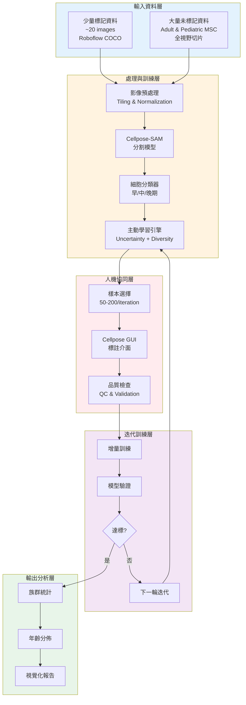
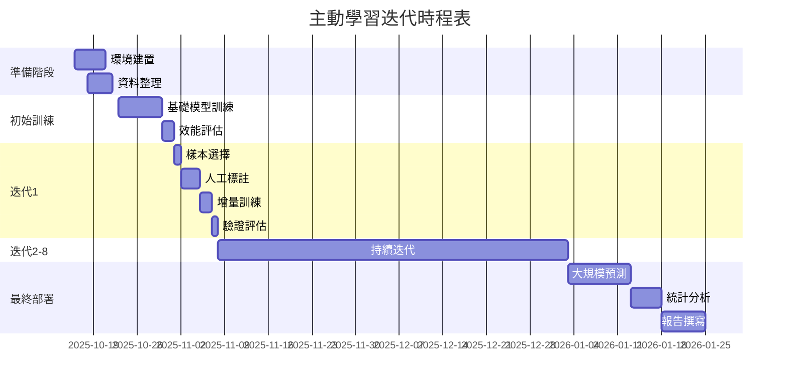
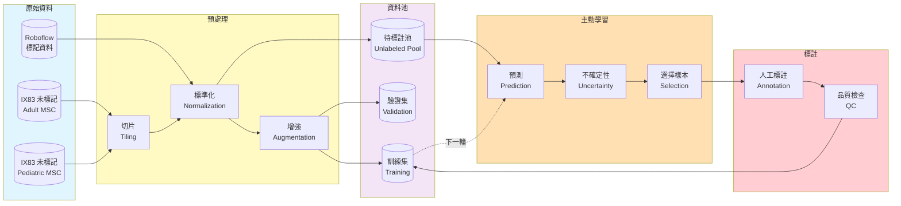
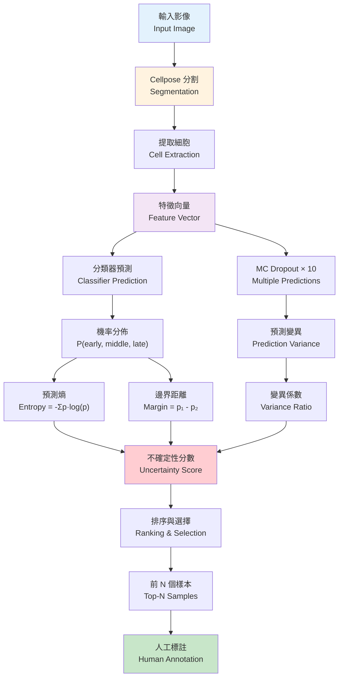
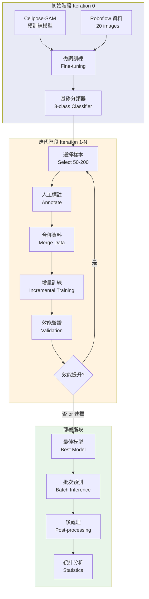
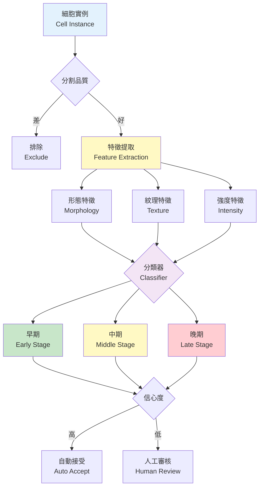
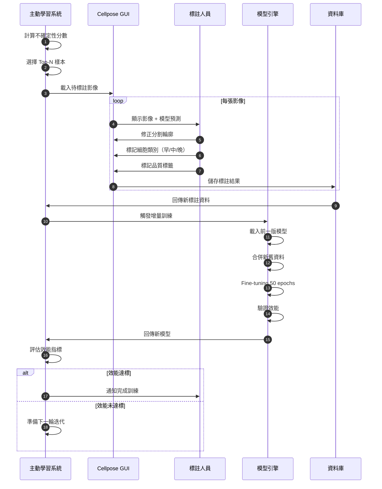
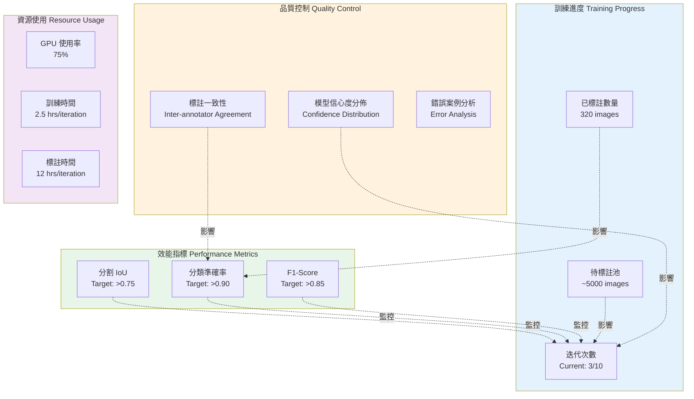
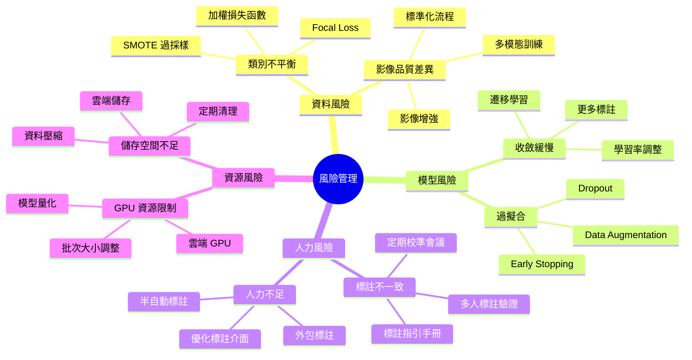
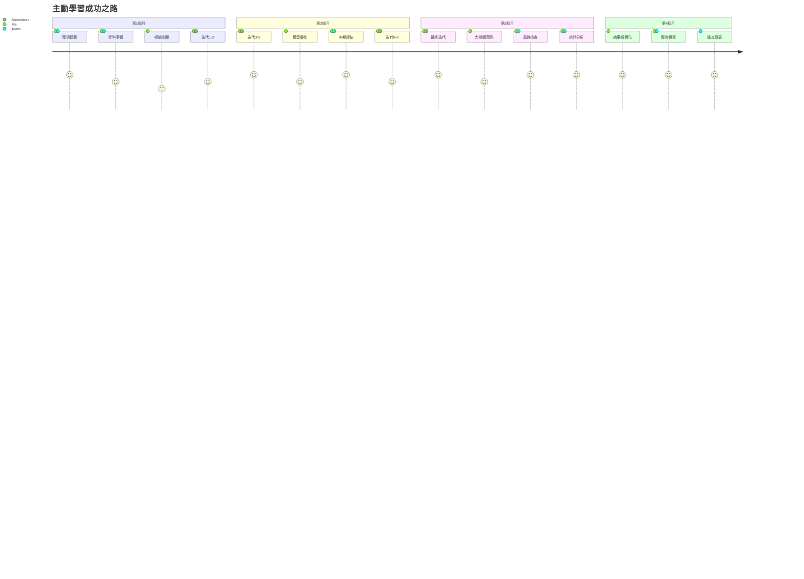

# 骨髓幹細胞年齡分析：詳細架構圖集

## 1. 整體系統架構（系統視角）

---

## 2. 主動學習迭代流程（時間序列視角）

---

## 3. 資料流轉圖（資料視角）

---

## 4. 不確定性計算流程（演算法視角）

---

## 5. 模型訓練策略（技術視角）

---

## 6. 細胞分類決策樹（生物學視角）

---

## 7. 人機介面互動流程（使用者視角）

---

## 8. 效能監控儀表板（管理視角）

---

## 9. 風險緩解策略（風險管理視角）

---

## 10. 成功路徑圖（目標視角）

---

## 使用說明

### 圖表用途
1. **圖1-2**：用於整體架構說明與時程規劃
2. **圖3-5**：用於技術細節說明
3. **圖6-7**：用於演示操作流程
4. **圖8-10**：用於專案管理與風險控制

### Mermaid 渲染
這些圖表使用 Mermaid 語法，可在以下平台渲染：
- GitHub / GitLab（自動渲染）
- VS Code（安裝 Mermaid 插件）
- [Mermaid Live Editor](https://mermaid.live/)
- Notion、Obsidian 等筆記軟體

### 匯出建議
- **簡報用**：匯出為 PNG/SVG 高解析度圖片
- **報告用**：直接嵌入 Markdown 文件
- **網頁用**：使用 Mermaid.js 動態渲染

---

**文件版本**：1.0  
**建立日期**：2025-10-16  
**適用專案**：骨髓幹細胞年齡分析
