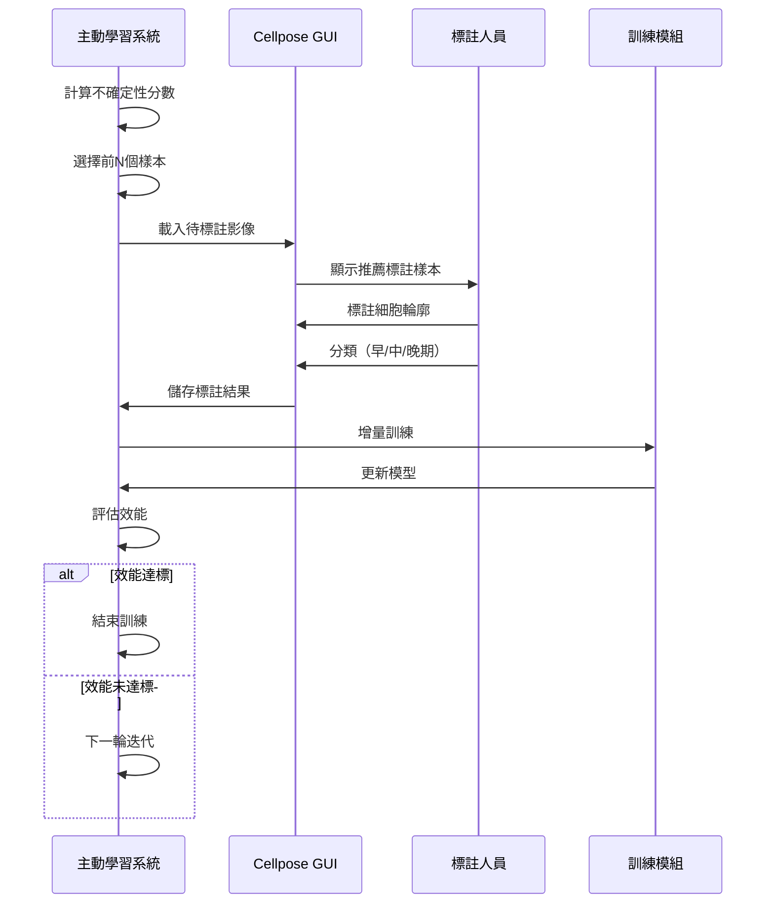

# 骨髓幹細胞年齡分析：人機協同主動學習架構提案

## 專案背景 (Project Background)

### 研究目標
分析骨髓幹細胞（Bone Marrow Stem Cells）的年齡階段，將細胞分為三類：
- **早期細胞 (Early Stage)**
- **中期細胞 (Middle Stage)**  
- **晚期細胞 (Late Stage)**

### 資料現況
1. **已標記訓練資料**：`raw_data/01 AI 分析細胞照片/05 輔仁大學Roboflow/`
   - 極少量標記資料（約15-20張影像）
   - COCO格式標註
   - 分為 train/valid/test 三個集合
   
2. **大量未標記資料**：`raw_data/01 AI 分析細胞照片/02 IX83 全通量細胞照片/`
   - Adult MSC（成人骨髓幹細胞）
   - Pediatric MSC（兒童骨髓幹細胞）
   - 包含超大全視野切片圖像（需要切片處理）
   - 按日期和實驗批次組織

### 技術框架分析
當前使用 **Cellpose-SAM** 框架：
- 基於深度學習的細胞分割模型
- 支援人機協同訓練 (Human-in-the-loop training)
- 內建 GUI 標註工具
- 支援自定義模型微調 (fine-tuning)
- 可處理大型影像資料

---

## 人機協同主動學習架構 (Human-in-the-Loop Active Learning Architecture)

### 架構圖 (Mermaid Diagram)

```mermaid
flowchart TB
    subgraph Data["資料層 Data Layer"]
        A1[("已標記資料<br/>Labeled Data<br/>(極少量)")]
        A2[("未標記資料<br/>Unlabeled Data<br/>(大量)")]
        A3[("超大切片<br/>Whole Slide Images")]
    end
    
    subgraph Preprocessing["預處理層 Preprocessing"]
        B1["影像切片<br/>Image Tiling"]
        B2["影像標準化<br/>Normalization"]
        B3["資料增強<br/>Data Augmentation"]
    end
    
    subgraph Model["模型層 Model Layer"]
        C1["Cellpose-SAM<br/>初始模型<br/>Initial Model"]
        C2["細胞分割<br/>Cell Segmentation"]
        C3["特徵提取<br/>Feature Extraction"]
        C4["分類器<br/>Classifier<br/>(早/中/晚期)"]
    end
    
    subgraph ActiveLearning["主動學習層 Active Learning"]
        D1["不確定性估計<br/>Uncertainty Estimation"]
        D2["樣本選擇策略<br/>Sample Selection"]
        D3["多樣性採樣<br/>Diversity Sampling"]
    end
    
    subgraph HumanLoop["人機協同層 Human-in-the-Loop"]
        E1["樣本優先排序<br/>Sample Prioritization"]
        E2["人工標註<br/>Manual Annotation<br/>(GUI)"]
        E3["標註品質檢查<br/>Quality Control"]
        E4["標註修正<br/>Annotation Refinement"]
    end
    
    subgraph Training["訓練層 Training Layer"]
        F1["增量訓練<br/>Incremental Training"]
        F2["模型微調<br/>Fine-tuning"]
        F3["模型驗證<br/>Model Validation"]
        F4["效能評估<br/>Performance Evaluation"]
    end
    
    subgraph Deployment["部署層 Deployment"]
        G1["批次預測<br/>Batch Prediction"]
        G2["統計分析<br/>Statistical Analysis"]
        G3["視覺化報告<br/>Visualization"]
    end
    
    subgraph Feedback["反饋機制 Feedback Loop"]
        H1{{"模型效能<br/>達標？"}}
        H2["繼續迭代<br/>Next Iteration"]
        H3["完成訓練<br/>Training Complete"]
    end
    
    %% Data Flow
    A1 --> B2
    A2 --> D1
    A3 --> B1
    B1 --> B2
    B2 --> B3
    B3 --> C1
    
    C1 --> C2
    C2 --> C3
    C3 --> C4
    
    C4 --> D1
    D1 --> D2
    D2 --> D3
    D3 --> E1
    
    E1 --> E2
    E2 --> E3
    E3 --> E4
    E4 --> F1
    
    F1 --> F2
    F2 --> F3
    F3 --> F4
    F4 --> H1
    
    H1 -->|未達標| H2
    H1 -->|達標| H3
    H2 --> D1
    H3 --> G1
    
    G1 --> G2
    G2 --> G3
    
    %% Styling
    classDef dataStyle fill:#e1f5ff,stroke:#01579b,stroke-width:2px
    classDef processStyle fill:#fff9c4,stroke:#f57f17,stroke-width:2px
    classDef modelStyle fill:#f3e5f5,stroke:#4a148c,stroke-width:2px
    classDef humanStyle fill:#ffebee,stroke:#b71c1c,stroke-width:2px
    classDef feedbackStyle fill:#e8f5e9,stroke:#1b5e20,stroke-width:2px
    
    class A1,A2,A3 dataStyle
    class B1,B2,B3,C2,C3 processStyle
    class C1,C4,F1,F2,F3,F4 modelStyle
    class E1,E2,E3,E4 humanStyle
    class H1,H2,H3,G1,G2,G3 feedbackStyle
```



---

## 核心技術策略 (Core Technical Strategies)

### 1. 不確定性估計方法 (Uncertainty Estimation)

```python
# 實施多種不確定性指標
uncertainty_metrics = {
    "prediction_entropy": "預測熵值",
    "margin_sampling": "邊界採樣",
    "variance_ratio": "方差比",
    "monte_carlo_dropout": "MC Dropout"
}
```

**推薦策略**：
- **預測熵 (Prediction Entropy)**：測量分類機率分佈的不確定性
- **邊界採樣 (Margin Sampling)**：選擇前兩個類別機率差異最小的樣本
- **MC Dropout**：多次前向傳播估計模型不確定性

### 2. 樣本選擇策略 (Sample Selection)

採用 **混合策略**：
1. **不確定性優先** (70%)：選擇模型最不確定的樣本
2. **多樣性保證** (20%)：確保覆蓋不同的細胞形態特徵
3. **代表性採樣** (10%)：考慮不同實驗批次和時間點

### 3. 增量訓練策略 (Incremental Training)

```python
training_schedule = {
    "iteration_1": {"labeled": 20, "new": 50},   # 初始模型
    "iteration_2": {"labeled": 70, "new": 100},  # 第一輪標註
    "iteration_3": {"labeled": 170, "new": 150}, # 第二輪標註
    "iteration_4": {"labeled": 320, "new": 200}, # 第三輪標註
    # ... 持續迭代直到達標
}
```

### 4. 超大影像處理策略

對於全視野切片圖像：
1. **智能切片**：使用滑動窗口自動切割
2. **重疊處理**：設置 overlap 避免邊界細胞遺漏
3. **區域優先級**：優先處理細胞密集區域

---

## 實施階段 (Implementation Phases)

### Phase 0: 環境準備 (週 1)
- [ ] 安裝 Cellpose-SAM 及依賴
- [ ] 資料格式統一與預處理
- [ ] 建立資料管理系統

### Phase 1: 基礎模型訓練 (週 2-3)
- [ ] 使用輔仁大學 Roboflow 資料訓練初始模型
- [ ] 評估基礎分割效能
- [ ] 建立分類器（早/中/晚期）

### Phase 2: 主動學習迭代 (週 4-12)
**每週迭代循環**：
1. 模型預測未標記資料
2. 計算不確定性分數
3. 選擇 50-200 個樣本供標註
4. 人工標註（使用 Cellpose GUI）
5. 模型微調與驗證
6. 效能評估

**目標迭代次數**：8-10 輪

### Phase 3: 大規模預測 (週 13-14)
- [ ] 處理全部 IX83 全通量資料
- [ ] 批次分割與分類
- [ ] 統計各族群數量

### Phase 4: 結果分析與報告 (週 15-16)
- [ ] 年齡分佈分析
- [ ] Adult vs Pediatric MSC 比較
- [ ] 視覺化與報告生成

---

## 技術實施細節 (Technical Implementation)

### 1. 資料管理結構

```
project_root/
├── data/
│   ├── labeled/
│   │   ├── iteration_0/   # 初始標記資料
│   │   ├── iteration_1/   # 第一輪標註
│   │   └── iteration_N/   # 第N輪標註
│   ├── unlabeled/         # 待標記資料池
│   ├── predictions/       # 模型預測結果
│   └── validation/        # 驗證集
├── models/
│   ├── cellpose_base/     # Cellpose-SAM 基礎模型
│   ├── iteration_1/       # 第一輪訓練模型
│   └── iteration_N/       # 第N輪訓練模型
├── notebooks/
│   ├── 01_data_exploration.ipynb
│   ├── 02_active_learning.ipynb
│   └── 03_analysis.ipynb
└── src/
    ├── preprocessing.py    # 預處理模組
    ├── active_learning.py  # 主動學習模組
    ├── training.py        # 訓練模組
    ├── inference.py       # 推論模組
    └── visualization.py   # 視覺化模組
```

### 2. 核心程式模組

#### 主動學習模組 (active_learning.py)
```python
class ActiveLearningSelector:
    """主動學習樣本選擇器"""
    
    def calculate_uncertainty(self, predictions):
        """計算預測不確定性"""
        pass
    
    def select_samples(self, pool, n_samples, strategy='mixed'):
        """選擇最有價值的樣本供標註"""
        pass
    
    def diversity_sampling(self, features, n_samples):
        """基於特徵多樣性選擇樣本"""
        pass
```

#### 增量訓練模組 (training.py)
```python
class IncrementalTrainer:
    """增量訓練管理器"""
    
    def load_previous_model(self, iteration):
        """載入前一輪模型"""
        pass
    
    def fine_tune(self, new_data, epochs=50):
        """微調模型"""
        pass
    
    def validate(self, val_data):
        """驗證模型效能"""
        pass
```

### 3. 人機介面流程



---

## 評估指標 (Evaluation Metrics)

### 分割效能指標
- **IoU (Intersection over Union)**：> 0.75
- **Dice Coefficient**：> 0.80
- **Precision / Recall**：> 0.85

### 分類效能指標
- **Overall Accuracy**：> 0.90
- **Per-class F1-score**：> 0.85
- **Confusion Matrix Analysis**：類別混淆分析

### 主動學習效率指標
- **標註效率**：每輪迭代效能提升曲線
- **樣本利用率**：達到目標效能所需樣本數
- **收斂速度**：達到效能穩定所需迭代次數

---

## 預期成果 (Expected Outcomes)

### 短期目標 (2-3個月)
1. 建立有效的主動學習訓練管線
2. 累積 500-1000 張高品質標註影像
3. 達到分割 IoU > 0.75，分類準確率 > 0.85

### 中期目標 (4-6個月)
1. 處理完成所有 IX83 全通量資料
2. 建立細胞年齡分析資料庫
3. 發表細胞族群統計報告

### 長期目標
1. 發展自動化細胞年齡鑑定系統
2. 支援即時顯微鏡影像分析
3. 擴展到其他類型幹細胞分析

---

## 風險與挑戰 (Risks & Challenges)

| 風險項目 | 影響程度 | 緩解策略 |
|---------|---------|---------|
| 標註人力不足 | 高 | 開發高效標註介面；培訓多位標註人員 |
| 模型過擬合 | 中 | 數據增強；正則化；交叉驗證 |
| 類別不平衡 | 中 | 加權損失函數；過採樣少數類 |
| 計算資源限制 | 中 | 雲端 GPU；批次處理；模型壓縮 |
| 影像品質差異 | 高 | 影像標準化；預處理增強；魯棒性訓練 |

---

## 資源需求 (Resource Requirements)

### 硬體需求
- **GPU**：NVIDIA GPU (>= 8GB VRAM) 用於訓練
- **RAM**：>= 32GB 用於處理大型影像
- **儲存**：>= 500GB SSD 用於資料與模型

### 人力需求
- **資料科學家/AI工程師**：1-2人（開發主動學習系統）
- **生物醫學專家**：1-2人（標註品質控制與驗證）
- **標註人員**：2-3人（進行人工標註工作）

### 時間需求
- **總週期**：16週（約4個月）
- **每週標註時間**：10-15小時
- **每次迭代週期**：5-7天

---

## 下一步行動 (Next Steps)

### 立即行動項目
1. ✅ **架構設計完成**（本文件）
2. ⬜ **環境建置**：安裝 Cellpose-SAM 與相關套件
3. ⬜ **資料整理**：統一格式，建立資料索引
4. ⬜ **基礎訓練**：訓練初始分割與分類模型

### 本週任務
- [ ] 確認硬體環境與 GPU 設定
- [ ] 解壓並檢查 Roboflow 標註資料
- [ ] 開發影像切片預處理腳本
- [ ] 建立專案目錄結構

### 需要討論的問題
1. **細胞分類標準**：早/中/晚期的判定依據是什麼？
2. **標註優先級**：Adult MSC 和 Pediatric MSC 哪個優先？
3. **標註工具**：使用 Cellpose GUI 還是其他工具？
4. **效能目標**：分割和分類的最低可接受準確率？

---

## 參考文獻與資源 (References)

### Cellpose 相關
- [Cellpose-SAM Paper](https://www.biorxiv.org/content/10.1101/2025.04.28.651001v1)
- [Cellpose Documentation](https://cellpose.readthedocs.io/)
- [Human-in-the-loop Tutorial Video](https://youtu.be/3Y1VKcxjNy4)

### 主動學習理論
- Settles, B. (2009). "Active Learning Literature Survey"
- Wang, K. et al. (2021). "Cost-Effective Active Learning for Deep Image Classification"

### 細胞影像分析
- Schmidt, U. et al. (2018). "Cell Detection with Star-convex Polygons"
- Stringer, C. et al. (2021). "Cellpose: a generalist algorithm for cellular segmentation"

---

## 附錄：快速開始指南 (Quick Start Guide)

### 環境安裝
```bash
# 建立 conda 環境
conda create -n cellpose-active python=3.10
conda activate cellpose-active

# 安裝 Cellpose-SAM
pip install cellpose[gui]

# 安裝額外套件
pip install scikit-learn pandas matplotlib seaborn tqdm
```

### 檢查資料

```python
import os
from pathlib import Path

# 檢查訓練資料
train_path = Path("../raw_data/01 AI 分析細胞照片/05 輔仁大學Roboflow/train")
print(f"訓練影像數量: {len(list(train_path.glob('*.jpg')))}")

# 檢查未標記資料
unlabeled_path = Path("../raw_data/01 AI 分析細胞照片/02 IX83 全通量細胞照片")
adult_msc = list(unlabeled_path.glob("Adult MSC/**/*.jpg"))
pediatric_msc = list(unlabeled_path.glob("Pediatric MSC/**/*.jpg"))
print(f"Adult MSC: {len(adult_msc)} 張")
print(f"Pediatric MSC: {len(pediatric_msc)} 張")
```

### 啟動 Cellpose GUI
```bash
python -m cellpose
```

---

**提案版本**：1.0  
**最後更新**：2025-10-16  
**提案人**：AI Assistant  
**審核狀態**：待審核
